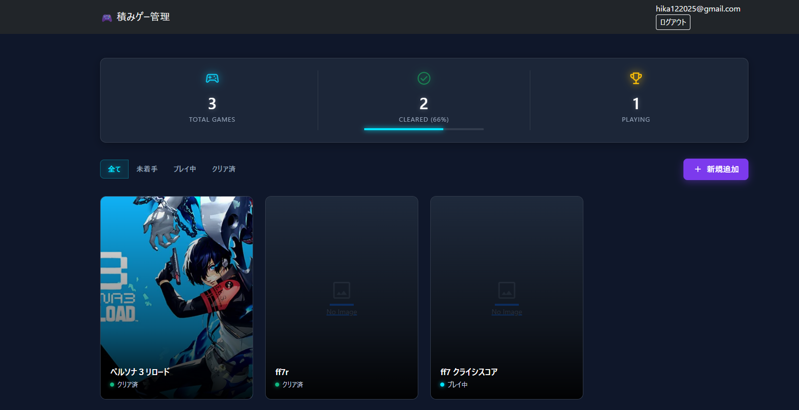
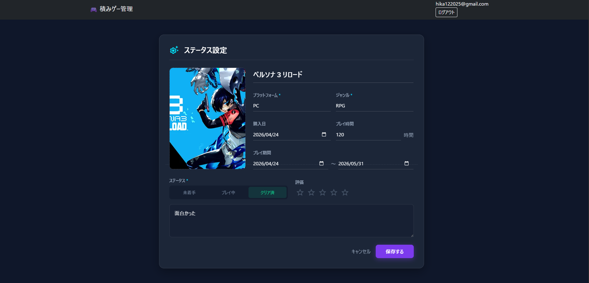

# 積みゲー管理 (Game Backlog Manager)

購入したものの未プレイ・未クリアのままになっているゲーム（積みゲー）を視覚的に管理し、消化状況を可視化するためのWebアプリケーションです。

## 概要
ゲーマー特有の課題である「積みゲー」を効率的に解消・管理することを目的に作成しました。所持しているゲームのステータス（未着手・プレイ中・クリア済）を一目で把握でき、ゲームの世界観に合わせたダークモードベースのUIを採用しています。

## 主な機能

* ダッシュボード・統計表示
  * 登録ゲームの「総数」「クリア率」「現在プレイ中の数」を画面上部のHUD（ヘッドアップディスプレイ）風パネルでリアルタイム表示
* ゲーム情報の管理 (CRUD)
  * タイトル、プラットフォーム、ジャンル、購入日、プレイ期間、プレイ時間、メモ等の記録
  * ゲームのパッケージ画像のアップロードおよび即時プレビュー機能
  * ステータス（未着手 / プレイ中 / クリア済）による一覧表示のフィルタリング
  * 5段階の星評価（レーティング）機能
* ユーザー認証・アカウント管理
  * Deviseを使用したログイン、アカウント登録、パスワードリセット機能
  * 新規登録時のメール送信によるアカウント有効化（アクティベーション）フロー

## 使用技術

* バックエンド: Ruby, Ruby on Rails
* フロントエンド: HTML, CSS, JavaScript
  * UIフレームワーク: Bootstrap 5
  * JavaScriptフレームワーク: Hotwire (Stimulus)
* データベース / ストレージ: Active Storage (画像保存)
* 認証・メール機能: Devise, ActionMailer
* デザイン・アイコン: FontAwesome 6, Material Symbols Outlined

## 開発において工夫・アピールした点

1. デザインと操作性 (UX/UI) へのこだわり
   * ダークモードを基調とし、Glassmorphic（すりガラス風）デザインやネオンカラーのアクセントをCSSで独自に構築しました。
   * 情報の視認性を高めるため、Bento Grid風の配置を用いて統計データやゲームカードを整理しています。
2. Stimulusを活用した動的なフロントエンド実装
   * 重厚なSPAフレームワークを採用せず、Rails標準のStimulusを活用することで、画像アップロード時の即時プレビュー機能やインタラクティブな星評価UIを軽量に実現しました。
3. 実践的な認証フローの構築
   * Deviseによる基本認証に加え、仮登録からメール経由で本登録を完了させるアクティベーション処理を独自に組み込み、セキュリティ面への配慮を盛り込みました。

## 画面構成

| ホーム画面 (ダッシュボード) | ゲーム登録・編集画面 |
| :---: | :---: |
|  |  |

## セットアップ手順

```bash
# リポジトリのクローン
git clone [https://github.com/username/repository-name.git](https://github.com/username/repository-name.git)
cd repository-name

# 依存関係のインストール
bundle install

# データベースの作成とマイグレーション
rails db:create db:migrate

# ローカルサーバーの起動
rails s